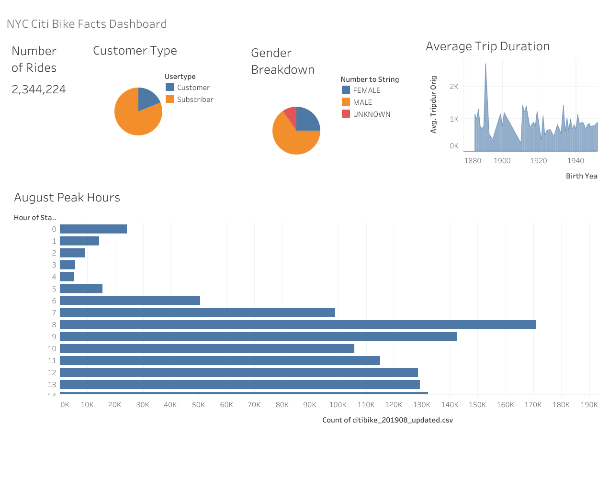
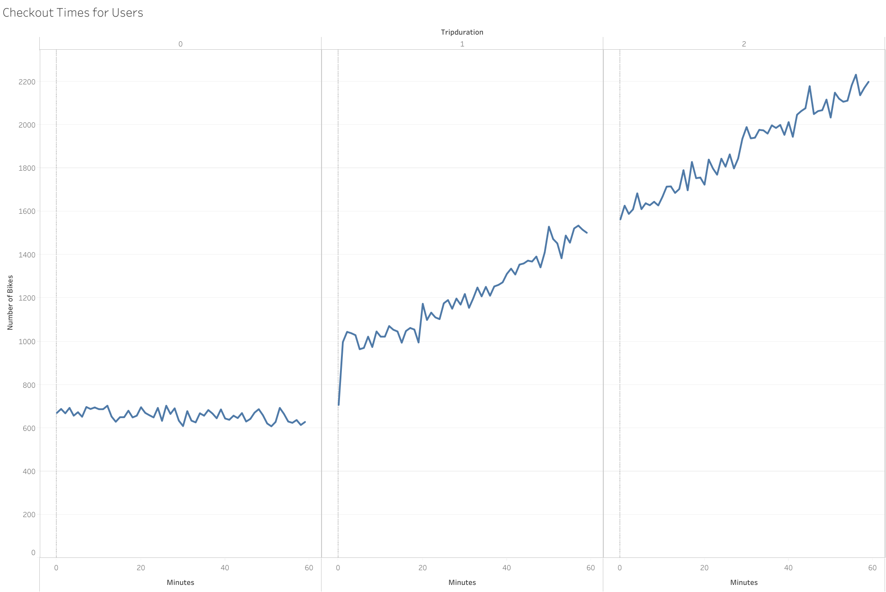

# NYC Citi Bike Analysis 

## Overview of NYC Citi Bike Analysis

I am analyzing how NYC Citi Bike business works in NYC to help create a proposal on how it might work in Des Moines, Iowa. I used Tableau to create visualizations that showed: 

-Show the length of time that bikes are checked out for all riders and genders
-Show the number of bike trips for all riders and genders for each hour of each day of the week
-Show the number of bike trips for each type of user and gender for each day of the week.

I used data from https://www.citibikenyc.com/system-data and downloaded the file name "201908-citibike-tripdata.csv.zip". 

## Results

Please see link to Tableau Story: [link to dashboard("https://public.tableau.com/app/profile/krystal.sung/viz/NYCCitiBikeStory_16286342835150/NYCCitiBike#1")

1. The NYC Citi Bike Facts Dashboard shows most customers are subscribers and males. 
2. The NYC Citi Bike Facts Dashboard shows the peak hours in August are before work around 8 am and after work around 5-6 pm. 

3. The Checkout Times for Users shows the number of bikes checked out increases as the trip duration increases. 

4. The Checkout Times for Gender illustrates that females and unknown checked out fewer bikes than males. For males, we see the number of bikes checked out drastically increase as the trip duration increases to 1-2 hours. 

5. The Trips by Weekday per Hour illustrates that Thursday is the busiest day for bikes. ALso the busiest time for bike check out is around 8 am and around 5-6 pm. 

.png")

6. The Trips by Gender (Weekday per Hour) again highlights more male riders than females. The busiest hours are 8 am and 5-6 pm. Thursday is the busiest day for bike checkouts. 

7. Finally, the User Trips by Gender by Weekday illustrates that Thursday for subscribers is the busiest day for bike checkouts. Monday, Tuesday, and Friday are days with high number of bike trips as well. 

## Summary

From the Tableau visualizations, I can concluding the following about NYC Citi Bike: 
1. Males check out more NYC Citi bikes than females. 
2. The number of bikes checked out increases as the ride length increases. 
3. Thursday is the busiest day for checking out bikes. 
4. The busiest time in the day for checking out bikes is around 8 am and around 5-6 pm.

Additional visualizations that may help provide insight on the NYC Citi bike business would be tracking popular bike routes to see which areas are the most popular for usage. Another visualization might be seeing the age distribution of riders. 

